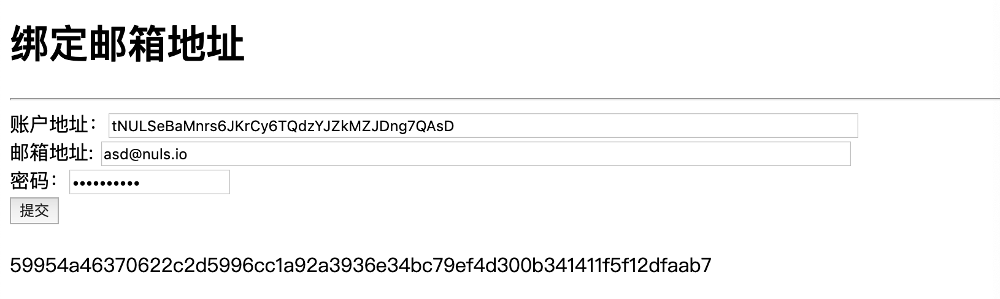
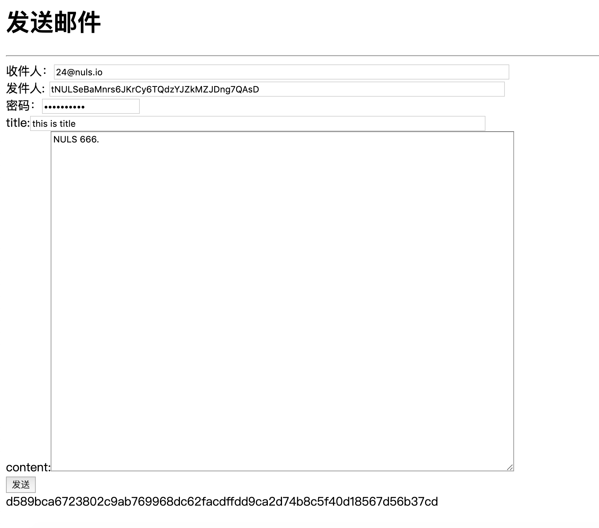
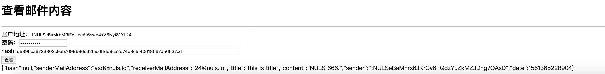

# NULS ChainBox
## NULS ChainBox是什么
ChainBox是一个快速搭建区块链的工具，封装了账本，账户，交易，区块，共识，网络六个底层模块，屏蔽了分布式数据存储、点对点传输、共识机制、加密算法等复杂区块链技术，开发者可使用它实现分钟级搭建TPS达1000的基础链，或根据标准通信协议开发业务模块，然后通过chainbox驱动组成一条全新的应用链


## 为什么需要Chainbox
 NULS ChainBox设计的初衷是帮助企业或应用开发者在区块链上能快速构建应用，并专注自己的业务实现，无需关心晦涩、复杂的区块链底层技术。

## 特点
NULS ChainBox本质上是NULS2.0的一个扩展应用，它的定位是一站式区块链开发平台，它有3个核心特点：

- 快速搭建开发环境

- 通过模板降低应用开发门槛

- 通过约定和脚本降低模板集成的难度，实现一键生成可运行程序

## 快速体验
在下面这个case中，你将体验到如何使用NULS ChainBox快速构建一套提供加密邮件服务的区块链应用

### 1 环境准备

- linux内核的操作系统
- 安装 Git
- 安装Maven
- 安装JDK11

### 2 获取NULS ChainBox

打开终端，执行以下命令

```
git clone https://github.com/nuls-io/nuls-chainbox.git chainbox
```
进入Chainbox文件夹
```
cd chainbox
```
快速构建一条可运行基础链
```
./tools -n
```
### 3 构建加密邮件模块
执行命令进入example目录

```
cd example   #进入示例文件夹
```
执行命令构建模块

```
./package    #执行构建脚本（模板提供）
```

看到以下输出后，说明构建完成

```
============ PACKAGE FINISH 🍺🍺🍺🎉🎉🎉 ===============
```

构建成功后会在example中生成outer文件夹

> PS:如果你想知道该模块是如何设计的，请查看[加密邮件模块设计文档](./example/模块设计文档.md)

### 4 集成加密邮件模块
回到chainbox根目录

```
cd ..
```

执行命令，集成加密模块到NULS2.0运行环境中

```
./tools -p example
```
看到以下输出后，说明集成成功

```
============ PACKAGE FINISH 🍺🍺🍺🎉🎉🎉 ===============
```

完成后在chainbox目录下会生成NULS-WALLET文件夹，此文件夹包含了集成了加密邮件模块的NULS2.0运行程序

若在不同机器部署了多个节点，建议修改NULS-WALLET/.default-config.ncf配置文件中的以下两个参数

 ```
#最小链接节点数,当链接到的网络节点低于此参数时,会持续等待
minNodeAmount=0

#种子节点出块地址
seedNodes=tNULSeBaMkrt4z9FYEkkR9D6choPVvQr94oYZp
```


### 5 启动节点程序
配置完成后，在NULS-WALLET目录执行以下命令

```
./start-mykernel
```
看到以下内容说明模块正在启动中

```
LOG PATH    : ~/NULS-WALLET/Logs
DATA PATH   : ~/NULS-WALLET/data
CONFIG FILE : ~/NULS-WALLET/nuls.ncf
DEBUG       : 0
JAVA_HOME   : /Library/java/JavaVirtualMachines/jdk-11.0.2.jdk/Contents/Home
java version "11.0.2" 2019-01-15 LTS
Java(TM) SE Runtime Environment 18.9 (build 11.0.2+9-LTS)
Java HotSpot(TM) 64-Bit Server VM 18.9 (build 11.0.2+9-LTS, mixed mode)

====================
NULS-WALLET STARING
====================
```

可通过以下命令检查模块启动情况

```
./check-status 
```
看到以下内容表示节点模块已全部启动成功

```
==================MODULE PROCESS====================
account PROCESS IS START
block PROCESS IS START
consensus PROCESS IS START
ledger PROCESS IS START
network PROCESS IS START
transaction PROCESS IS START
==================RPC REDAY MODULE==================
account RPC READY
block RPC READY
consensus RPC READY
ledger RPC READY
network RPC READY
transaction RPC READY
======================REDAY MODULE==================
account STATE IS READY
block STATE IS READY
consensus STATE IS READY
ledger STATE IS READY
network STATE IS READY
transaction STATE IS READY
================TRY RUNNING MODULE==================
account TRY RUNNING
block TRY RUNNING
consensus TRY RUNNING
ledger TRY RUNNING
network TRY RUNNING
transaction TRY RUNNING
===================RUNNING MODULE===================
account STATE IS RUNNING
block STATE IS RUNNING
consensus STATE IS RUNNING
ledger STATE IS RUNNING
network STATE IS RUNNING
transaction STATE IS RUNNING
==================NULS WALLET STATE=================
==========================
NULS WALLET IS RUNNING
==========================
```

### 7 导入种子节点出块地址
现在种子节点已经启动，我们需进入命令行导入默认的种子出块地址，让节点开始出块

首先进入命令行

```
./cmd 
```
导入出块地址

```
nuls>>> import b54db432bba7e13a6c4a28f65b925b18e63bcb79143f7b894fa735d5d3d09db5 #通过私钥导入种子节点地址,此私钥生成的地址必须与第5步第2条的地址相同
Please enter the password (password is between 8 and 20 inclusive of numbers and letters), If you do not want to set a password, return directly.
Enter your password:**********  #设置导入地址的密码，此密码与第4步第3条记录的密码必须一致
Please confirm new password:********** #重复上一步输入的密码
tNULSeBaMkrt4z9FYEkkR9D6choPVvQr94oYZp #导入地址成功，验证此地址是否与第4步第2条的配置项完全一致
```

### 8 使用加密邮件

- 准备2个账户，用于测试发送和接收邮件，下方两个地址是测试环境创世块中定义的地址，账户中有一定数量的资产供测试使用。  

  ```
  nuls>>> import 477059f40708313626cccd26f276646e4466032cabceccbf571a7c46f954eb75
  Please enter the password (password is between 8 and 20 inclusive of numbers and letters), If you do not want to set a password, return directly.
  Enter your password:**********
  Please confirm new password:**********
  tNULSeBaMnrs6JKrCy6TQdzYJZkMZJDng7QAsD
  
  nuls>>> import 8212e7ba23c8b52790c45b0514490356cd819db15d364cbe08659b5888339e78
  Please enter the password (password is between 8 and 20 inclusive of numbers and letters), If you do not want to set a password, return directly.
  Enter your password:**********
  Please confirm new password:**********
  tNULSeBaMrbMRiFAUeeAt6swb4xVBNyi81YL24
  ```

  

- 进入NULS-WELLET/Modules/Nuls/mail-example/1.0.0目录，用浏览器打开mail-test.html（这是一个简单的测试页面，可以测试绑定邮箱地址、收发邮件等功能），首先给账户绑定邮箱地址
  
  输入两个测试账户地址、设置一个邮箱地址、输入刚才设置的测试账户密码。提交成功后将返回此交易的hash值。此处我们申请邮箱地址分别为asd@nuls.io和l24@nuls.io。

- 现在我们测试用asd@nuls.io向l24@nuls.io发送邮件。注意发件人使用的是账户地址。
  输入收件人邮箱地址、发件人账户地址、发件人账户密码。提交成功后将返回此交易的hash值。

- 等待大约10秒钟后（确保交易已经确认），通过发送邮件的hash值查看邮件内容，只有发件人和收件人才能查看。
  

  ```
  {
      "senderMailAddress": "asd@nuls.io",   //发件人邮箱地址
      "receiverMailAddress": "24@nuls.io",  //收件人邮箱地址
      "title": "this is title",             //邮件标题
      "content": "NULS 666.",               //邮件内容
      "sender": "tNULSeBaMnrs6JKrCy6TQdzYJZkMZJDng7QAsD",   //发件人账户地址
      "date": 1561365228904                 //发件时间戳（1970年1月1日到当前的毫秒数）
  }
  ```

## 模块模板列表
* [java模块开发模板](https://github.com/nuls-io/nuls-module-template-java)
* 区块链浏览器模板
* 浏览器钱包模板

## 文档列表
* [NULS ChainBox使用指南](./document/use-guide.md)
* [Java模块开发模板使用文档](https://github.com/nuls-io/nuls-module-template-java)
* [加密邮件示例模块设计文档](./example/模块设计文档.md)
* 账户模块RPC接口文档
* 账本模块RPC接口文档
* 交易模块RPC接口文档
* 区块模块RPC接口文档
* 共识模块RPC接口文档
* 网络模块RPC接口文档

## Contribution

Contributions to NULS are welcomed! We sincerely invite developers who experienced in blockchain field to join in NULS technology community. Details: s: https://nuls.communimunity/d/9-recruitment-of-community-developers To be a great community, Nuls needs to welcome developers from all walks of life, with different backgrounds, and with a wide range of experience.

## License

Nuls is released under the [MIT](http://opensource.org/licenses/MIT) license.
Modules added in the future may be release under different license, will specified in the module library path.

## Community

- [nuls.io](https://nuls.io/)
- [@twitter](https://twitter.com/nulsservice)
- [facebook](https://www.facebook.com/nulscommunity/)
- [YouTube channel](https://www.youtube.com/channel/UC8FkLeF4QW6Undm4B3InN1Q?view_as=subscriber)
- Telegram [NULS Community](https://t.me/Nulsio)
- Telegram [NULS 中文社区](https://t.me/Nulscn)

####  
