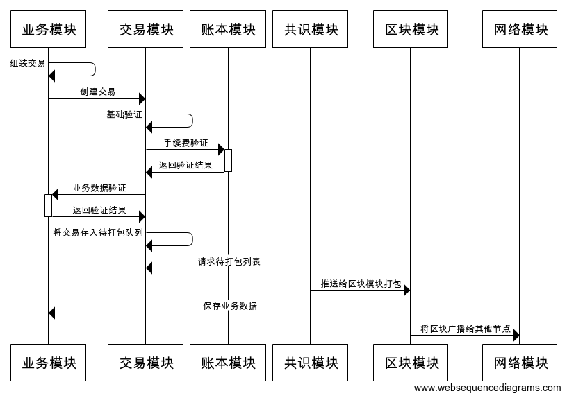
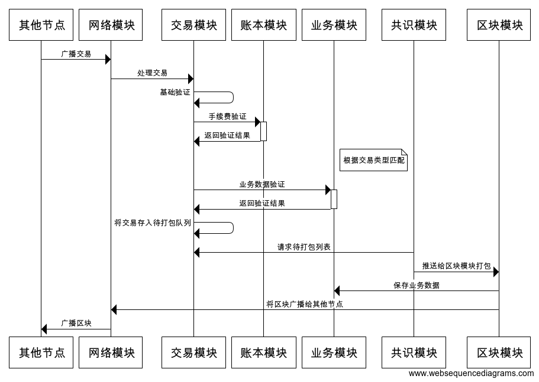

# 目录结构介绍
## tools
NULS引擎操作入口，提供获取程序、集成打包等操作。命令参数文档。
## document
文档列表
## example
基于java模块模板开发的一个加密邮件的示例模块程序源码。
## template
存储目前支持的语言的模板列表
# 准备开发环境
1. 暂时只支持macOS,centos,ubuntu等linux内核的操作系统。
2. NULS引擎会通过git命令在github.com上拉取代码，需要提前安装git客户端程序。
3. NULS2.0是基于JAVA语言开发，要运行NULS2.0节点需要安装JDK，目前依赖的JDK版本是jdk-11.0.2

# 获取NULS2.0运行环境
NULS2.0运行环境包含一套最基础的区块链程序，里面包含了账户、账本、区块、网络、交易、共识（poc）6大核心模块。运行NULS2.0基础运行环境你可以得到包含账户模型、转账交易、POC共识激励等区块链底层的核心功能。如果只想发一条简单的转账交易的链，修改一下配置文件就完成了（完整的配置列表）。你可以在基础环境中集成自己的业务模块，通过扩展一个新的交易类型的方式完成自己的业务，在下面一个段落中我会详细介绍如何构建自己的业务。

使用tools脚本获取NULS2.0运行环境

```
./tools -n
```
脚本会首先检查当前环境，然后从拉取NULS2.0在github仓库里的代码，执行package完成NULS2.0编译打包，将可运行程序输出到./NULS-WALLET-RUNTIME目录中。
当看到以下内容时表示打包完成。

```
============ ~/nuls-engine/NULS-WALLET-RUNTIME PACKAGE FINISH 🍺🍺🍺🎉🎉🎉 ===============
```
## NULS-WALLET-RUNTIME目录结构
### start-mykernel
启动节点
### stop-mykernel
停止节点
### check-status 
检查各个模块运行状态
### cmd
命令行启动脚本
### create-address
创建地址工具
### nuls.ncf
配置文件（首次运行start-mykernel脚本后创建）
#### 更多使用方法参考（NULS2.0钱包使用手册）
## 如何开发自己的模块
NULS2.0是用JAVA语言编写的分布式微服务架构的程序，整个节点程序由多个模块组成，每个模块之间通过websocket协议通信。NULS2.0定义了一套标准的模块通信协议，可以通过各种开发语言实现此标准协议与其他模块通信，进而实现自己的业务逻辑。扩展自己的业务逻辑主要是通过扩展新的交易类型实现，在交易的txData中存储自己的业务数据，txData将跟随交易存储在链上。
### 创建交易流程

### 处理网络交易流程


从图中可以看出扩展一个新的业务模块主要需要做4件事
1. 在交易模块注册自己的交易类型。
2. 组装交易数据，调用交易模块创建新的交易。
3. 验证交易中的业务数据是否合法。
4. 将交易中的业务数据保存到节点数据库中。

当然除了上面4步，还需要根据具体的业务需求对业务数据进行使用。下面我就对以上4步进行详细介绍。

在系统中每种交易都需要定义一个整数类型的唯一的交易类型（扩展的交易通常用200以上的值），用于区分处理的交易的回调函数。通常应该在模块启动的时候调用交易模块提供的注册交易接口（请查看交易模块的RPC接口文档）。当交易模块拿到一条待处理的交易时，会根据交易类型路由到注册的验证函数对交易业务数据的合法性进行校验。除了验证以外还有commitTx(保存交易业务数据）、rollbackTx（回滚交易的业务数据）两个函数。

通常由业务模块组装自己扩展的交易类型，一条合法的交易中包括交易类型、时间戳、CoinData、txData、备注、签名几个部分。其中CoinData中包含了转账数据，转出账户、转入账户、转账金额、资产信息等。而txData中主要用了保存业务数据，底层不会对txData字段进行验证和处理，业务模块根据业务设计在txData中存储自己的业务数据。签名字段通过椭圆形曲线算法对所有交易数据进行签名，确保在传输过程中数据不被串改。组装完成后，调用交易模块接口创建交易。

交易模块会通过当前节点自己创建获得交易，也会通过网络模块接收其他节点广播过来的交易。交易模块拿到交易后，首先会对交易数据的参数是否合法，然后检查账户余额是否足够支付交易手续费，然后验证账户的nonce值(通过控制交易顺序来保证余额不被重复使用的一种算法）是否合法。验证通过后根据交易类型找到业务验证的回调函数，对交易进行业务验证。

最后当交易打入区块，并且区块已经确认后，将在通过交易类型找到存储业务数据的回调函数，通知业务模块可以保持业务数据导节点本地。有些情况可能会出现区块回滚。当区块发生回滚时，也会通过交易类型匹配到对应的交易回滚回调函数，对业务数据进行回滚处理。

以上就是扩展一种交易类型需要完成的几个核心步骤。