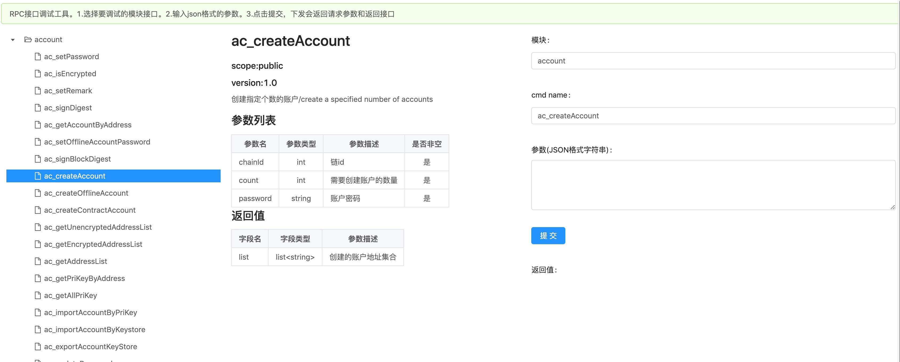

# NULS2.0 RPC接口调试工具

rpc-debug-tool可以帮助开发者调试其他模块通信接口。
## 使用方法
### 编译程序
此工具是通过java模块开发模板构建的一个NULS2.0模块，需要先编译可执行程序。

```
./package
```
看到以下内容编译完成。

```
============ PACKAGE FINISH 🍺🍺🍺🎉🎉🎉 ===============
```
编译完成后在当前目录会新增bin目录，目录结构如下：

```
.
├── Module.ncf
├── lib
├── rpc-debug-tool-1.0.0.jar
├── start.sh
├── stop.sh
└── www
```
### 启动服务
首先需要在nuls-chainbox中获取NULS2.0运行环境(NULS-WALLET-RUNTIME),启动NULS2.0程序([启动方法](https://github.com/nuls-io/nuls-v2/blob/beta-1/useguide.md)）。
然后启动rpc-debug-tool。
```
cd ./bin
./start
```
看到以下内容启动成功。

```
==================================================
http://localhost:1999/
==================================================
```
### 打开工具页面
浏览器访问http://localhost:1999/


工具分为3个部分：
* 左侧树选择要调试的接口，先选择模块再选择接口。
* 中间是对选择接口的描述。
* 右侧是调用接口。需要输入参数部分，参数内容应该是json格式。比如创建账户的参数
    
```
{"chainId":2,"count":1,"password":"nuls123456"}
```
输入完毕后，点击提交按钮，在下部会显示调用接口。调用接口包含response和request两个参数，分别为调用模块RPC接口返回的数据结构和请求的数据结构。

```
{
    "request": {
        "MessageID": "156212597872537",
        "Timestamp": "1562125978725",
        "TimeZone": "9",
        "MessageType": "Request",
        "MessageData": {
            "RequestAck": "0",
            "SubscriptionEventCounter": "0",
            "SubscriptionPeriod": "0",
            "SubscriptionRange": "0",
            "ResponseMaxSize": "0",
            "RequestMethods": {
                "ac_createAccount": {
                    "chainId": 2,
                    "count": 1,
                    "password": "nuls123456"
                }
            }
        }
    },
    "response": {
        "RequestID": "156212597872537",
        "ResponseProcessingTime": "12",
        "ResponseStatus": 0,
        "ResponseComment": "success",
        "ResponseMaxSize": "0",
        "ResponseData": {
            "ac_createAccount": {
                "list": [
                    "tNULSeBaMt4rzDd1PvUQcD4HGUNx5BGqzg9YoG"
                ]
            }
        },
        "ResponseErrorCode": null
    }
}
```
## Contribution

Contributions to NULS are welcomed! We sincerely invite developers who experienced in blockchain field to join in NULS technology community. Details: s: https://nuls.communimunity/d/9-recruitment-of-community-developers To be a great community, Nuls needs to welcome developers from all walks of life, with different backgrounds, and with a wide range of experience.

## License

Nuls is released under the [MIT](http://opensource.org/licenses/MIT) license.
Modules added in the future may be release under different license, will specified in the module library path.

## Community

- [nuls.io](https://nuls.io/)
- [@twitter](https://twitter.com/nulsservice)
- [facebook](https://www.facebook.com/nulscommunity/)
- [YouTube channel](https://www.youtube.com/channel/UC8FkLeF4QW6Undm4B3InN1Q?view_as=subscriber)
- Telegram [NULS Community](https://t.me/Nulsio)
- Telegram [NULS 中文社区](https://t.me/Nulscn)

####  
